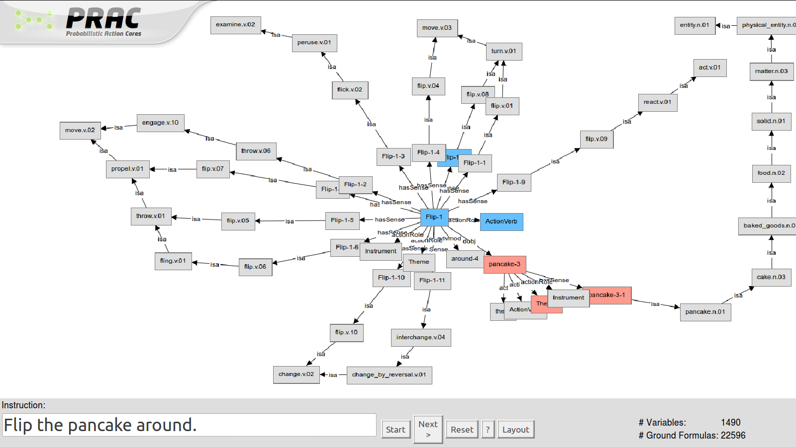

==========================================
PRACVIZ -- Visualization of PRAC Inference
==========================================

*PRAC* comes with a web-based browser application for nicely visualizing
inferences in PRAC, named *PRACVIZ*. In order to run it, make sure that it as been
successfully built with::
    
    python make_apps.py
    
There should be no errors in the section of *Building pracviz*

Once *PRACVIZ* has been built, you can run the server by typing::

    pracserver
    
It may take a couple of seconds to start up. After that, you can access
the *PRACVIZ* tool by visiting

    http://localhost:8080/
    
in you favorite web browser. The *PRACVIZ* tool should look somewhat like
this:

